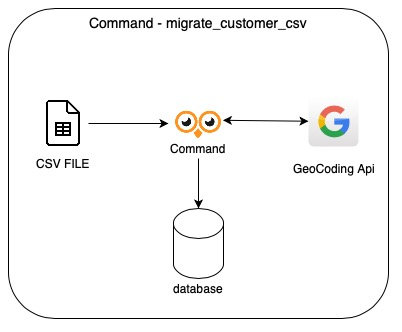

# oowlish_challenge

# Customer APP
    App to list all customers

# Architecture
## Command migrate_customer_csv


## Customer APP


# Steps to build locally
To run Customer API locally follow the steps bellow:

* [Install the application](#install)
* [Create a SQL Lite database](#database)
* [Import csv data file](#command)
* [Run Django Server](#runserver)
* [Usage](#usage)


## <a name="install"></a> Installation

Use the package manager [pip](https://pip.pypa.io/en/stable/) to install the requirements. Linux enviroments just follow the commands bellow:

```bash
$ git clone https://github.com/heitoranjos15/oowlish_challenge
$ cd oowlish_challenge
$ python3 -m venv env
$ source env/bin/activate
$ pip install -r requirements.txt
```

## <a name="database"></a> Create SQLite Database

```bash
$ python manage.py migrate
```

## <a name="command"></a> Import csv data file
```bash
$ python manage.py migrate_customer_csv --path PATH_FILE/FILE.CSV
```

## <a name="runserver"></a> Run the Django Server
```bash
$ python manage.py runserver
```

## <a name="usage"></a>  Usage
To get customer informations we have to 2 options

1. Type this URL on your browser:
```bash
$ http://localhost:8000/documentation
```


2. With cURLs:
    #### customers/{page}:
    ```bash
    $ curl --location --request GET 'http://127.0.0.1:8000/customers/1'
    ```
    #### customer/{id}:
    ```bash
    $ curl --location --request GET 'http://127.0.0.1:8000/customer/1'
    ```


## Run Tests
Inside the project folder run the flow command:

```bash
$ source env/bin/activation
$ python manage.py test
```

## DB Configuration
To generate the migration file run this steps:

```bash
$ source env/bin/activation
$ python manage.py makemigrations
```

After that, run the migrate command to create the tables on db.
```bash
$ python manage.py migrate
```

## Run server

```bash
$ source env/bin/activation
$ python manage.py runserver
```

## Tasks
- [x] Create a Django App
- [x] Create a migrate_customer_csv command to import csv data
- [x] Integration with Google GeoCoding
- [x] Create a function asyncronous to insert on customer table
- [x] Create Endpoints to get customer informations
- [x] Documentation
- [x] Test for Endpoints
- [ ] Test for migrate_customer_csv command
- [ ] DockerFile
- [ ] Terraform deploy

